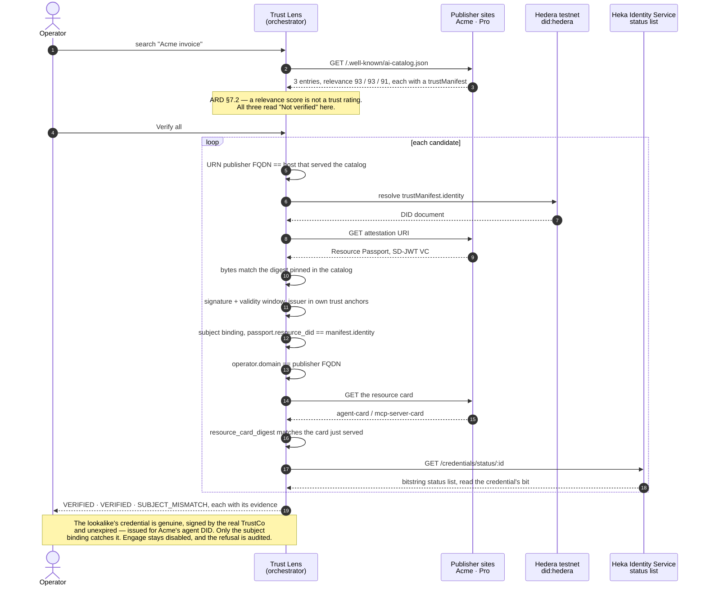
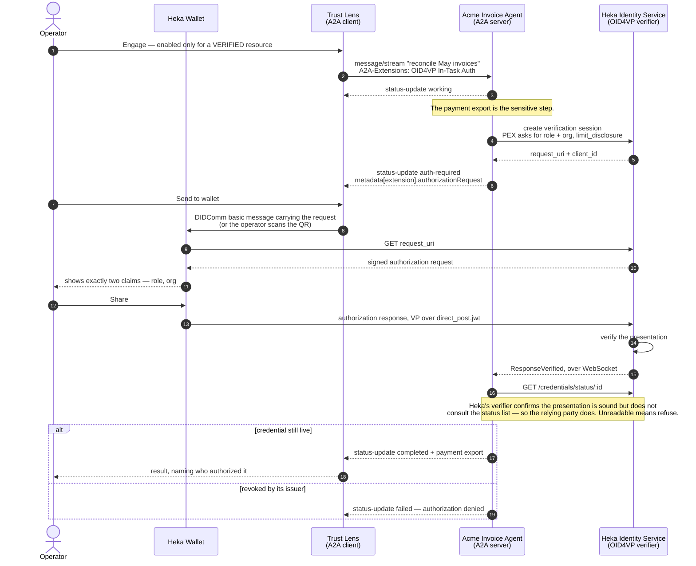
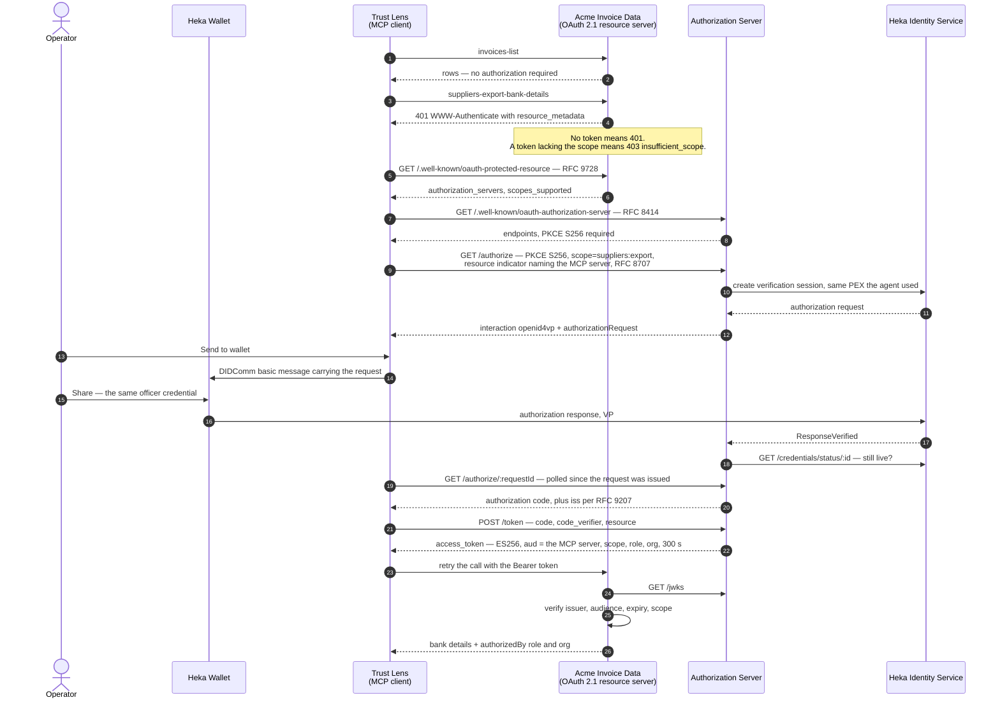

# Trust Lens — VC-attested discovery (ARD) + A2A In-Task Auth + MCP OAuth demo

This demo is built around two trust gaps that enterprise multi-agent ecosystems hit before any agent does useful work: knowing _who published_ a resource you just discovered, and tying a sensitive step to _a human with a role_ rather than to a session authenticated hours ago at some perimeter.

It leverages [Agentic Resource Discovery (ARD)](https://github.com/ards-project/ard-spec) and its [AI Catalog](https://ai-catalog.io) format for discovery, the [OID4VP In-Task Authorization Extension for A2A](https://github.com/a2aproject/experimental-ext-oid4vp-auth) for agent-to-agent engagement, and the [MCP authorization specification](https://modelcontextprotocol.io/specification/2026-07-28/basic/authorization) (OAuth 2.1) for tool access — with the OAuth grant backed by an [OpenID for Verifiable Presentations](https://openid.net/specs/openid-4-verifiable-presentations-1_0.html) presentation of the same credential.

The demo is built using [Genkit](https://genkit.dev/) with the OpenAI API (optional — without a key the agent produces the same report deterministically).
Heka Identity Platform is used as the credential issuer, the OID4VP verifier, and the status-list authority; [Heka Wallet](../../heka-wallet) is the operator's holder.

The thesis, in one line: **before you use a resource, verify it; before it serves you, it verifies you.**

## Scenario and Demo Flow

An orchestrator needs to reach the published resources of Acme Corp, a contracted supplier. It knows the company; it does not yet know the endpoints. A directory can find candidates — it cannot say which of them Acme actually operates.

Searching returns three well-matching resources from two publishers, one of which is a lookalike. Verification separates them, and the two that survive are then used over two different protocols, each gated by the same role credential.

The following mapping applies for the roles/parties described in the specifications above:

| Specification       | Role                        | In this demo                                                                                                                   |
| ------------------- | --------------------------- | ------------------------------------------------------------------------------------------------------------------------------ |
| ARD                 | Catalog publisher           | [Publisher sites](src/sites.ts), [`static/`](static/) — Acme (genuine) and Pro (lookalike)                                     |
| ARD                 | Registry / directory        | Discovery in [Trust Lens](src/web/server.ts) (reads publishers directly — see [ADR-002](spec/ADR-002-registry-integration.md)) |
| ARD                 | Trust evaluator (consumer)  | [Verification engine](src/core/verify.ts)                                                                                      |
| OID4VP In-Task Auth | A2A Client                  | [Trust Lens task runner](src/web/tasks.ts)                                                                                     |
| OID4VP In-Task Auth | A2A Server                  | [Acme Invoice Agent](src/agent/index.ts)                                                                                       |
| OID4VP              | Wallet (Holder)             | [Heka Wallet](../../heka-wallet), or the [simulated holder](src/shared/simulated-wallet.ts)                                    |
| OID4VP              | Verifier                    | [Heka Identity Service](../../heka-identity-service)                                                                           |
| MCP authorization   | MCP Client                  | [src/web/mcp-client.ts](src/web/mcp-client.ts)                                                                                 |
| MCP authorization   | Resource Server             | [Acme Invoice Data](src/mcp/server.ts)                                                                                         |
| MCP authorization   | Authorization Server        | [src/mcp/auth-server.ts](src/mcp/auth-server.ts)                                                                               |
| —                   | Credential issuer (TrustCo) | [TrustCo Console](src/console), backed by Heka Identity Service                                                                |

Three exchanges, in the order the demo runs them. The first decides _whether to talk to a resource at all_; the other two are the resource deciding whether to serve.

### Flow 1 — Discovery and verification



1. **Discovery**: the operator searches an ARD catalog. Three resources come back from two publishers — _Acme Invoice Agent_ (A2A), _Acme Invoice Data_ (MCP) and a lookalike _AcmeInvoice Pro Agent_ — scoring 93 / 93 / 91. The directory cannot separate them, and per ARD §7.2 its score **must not** be read as trust.
2. **Identity resolution**: for each candidate the Trust Lens checks that the URN's publisher FQDN matches the host that served the catalog, then resolves `trustManifest.identity` on Hedera.
3. **Attestation**: it fetches the Resource Passport at the attestation URI and binds it to the catalog by digest _before_ trusting anything it says.
4. **Credential checks**: signature and validity window, then whether the issuer is one of the orchestrator's own trust anchors — a decision the registry has no part in.
5. **Binding checks**: the passport's `resource_did` against the manifest identity, the operator domain against the publisher FQDN, and the pinned card digest against the card actually served.
6. **Revocation**: the issuer's status list, checked last and never cached — it is the only input that can change between two identical requests. A passport with no status pointer at all is `NO_STATUS` — a credential that can never be revoked is not one the Trust Lens relies on.
7. **Verdict**: `VERIFIED`, `VERIFIED`, `SUBJECT_MISMATCH`. The lookalike's credential is genuine, correctly signed by the real TrustCo and unexpired; it was simply issued for _Acme's_ agent. Signature, issuer, domain anchoring and digests all pass — only the subject binding catches it. Engagement is refused and the refusal is audited.

### Flow 2 — A2A engagement (OID4VP In-Task Authorization)



1. **Task initiation**: only a `VERIFIED` resource can be engaged; the control is disabled otherwise and an attempt is recorded.
2. **In-task authentication request**: the agent works until the payment export, decides that step is sensitive, asks Heka for an OID4VP request and returns `auth-required` carrying it in `message.metadata[<extension URI>]`.
3. **Wallet invocation**: the operator presses **Send to wallet** and the Trust Lens delivers the request to the linked Heka Wallet as a DIDComm basic message — the same mechanism as `demo/a2a-oid4vp`. A QR code and the raw URI are shown alongside for a phone with a camera.
4. **Sharing the presentation**: the wallet fetches and verifies the request, shows exactly two claims — `role` and `org` — and submits the VP over `direct_post.jwt` only after the person taps Share.
5. **Verification**: Heka validates the presentation and notifies the agent over WebSocket.
6. **Revocation check**: the agent then consults the status list itself, because Heka's verifier does not. An unreadable list means refuse.
7. **Task execution**: the export is produced. The agent never learns _who_ the operator is — only that someone holding a Finance Data Officer credential approved this step, at this moment.

Without a phone, **Simulate presentation** drives an in-process holder through the identical exchange.

### Flow 3 — MCP access (OAuth 2.1 scope step-up)



1. **Least privilege per call**: `invoices-list` answers immediately — being verified at discovery is not the same as being unlocked. `suppliers-export-bank-details` answers `401` and names the scope it needs. (A token that exists but lacks that scope gets `403 insufficient_scope` instead.)
2. **Step-up**: the client walks the spec's own chain — protected resource metadata (RFC 9728) → authorization server metadata (RFC 8414) → authorization with PKCE S256 and an RFC 8707 resource indicator.
3. **Interaction**: where a login form would be, the authorization server runs an OID4VP presentation asking for the **same officer credential**. The Trust Lens pushes it to the wallet exactly as in the A2A path.
4. **Grant**: after verifying the presentation and checking the status list, it mints a ~5 minute ES256 token carrying `scope`, `role` and `org`, audience-bound to that one MCP server.
5. **Retry**: the original call succeeds and the resource server reports `authorizedBy`.

The resource server never sees a credential, a DID or a presentation — it validates a JWT, exactly as any OAuth 2.1 resource server would. That is the point: the composition needs no bespoke wire format, so an ordinary MCP client still works. The audience binding is what makes it safe — the token is useless at any other resource.

### Kill switches and audit

Both protocol paths converge on the same status-list check, so **one revocation closes both**: the agent refuses to resume, and the authorization server refuses to mint. The presentation stays cryptographically valid in both cases — what changed is the issuer's statement about it.

Revoking a single Resource Passport instead flips that one entry to `REVOKED` and leaves its neighbour usable — per-resource granularity, with no catalog republish and no registry involvement.

Every trust decision — verification, refusal, authorization, denial — is recorded with the evidence behind it.

## Running the Demo

There are two ways to run it, and **mixing them fails quietly**. The publisher sites container publishes no host port on purpose, so a Trust Lens running on the host cannot reach it — discovery then returns an empty result set with no error in any log. Pick a path and keep all six services on it.

|                   | Path A — on your machine                             | Path B — in containers                  |
| ----------------- | ---------------------------------------------------- | --------------------------------------- |
| Requires          | Node.js 22, yarn 4.16 via corepack, Docker for Heka  | Docker only                             |
| On Windows        | works — askar 0.6 ships a prebuilt `aries_askar.dll` | works                                   |
| Publisher domains | one `hosts` file entry (needs admin)                 | handled by Docker network aliases       |
| Best when         | you are editing the code                             | you would rather keep Node off the host |

Steps 1 and 2 are common to both. Then jump to [Path A](#path-a--on-your-machine) or [Path B](#path-b--in-containers).

> **Which shell.** Every command here assumes a POSIX shell — bash, zsh, or **Git Bash / WSL on Windows**. In PowerShell `curl` is an alias for `Invoke-WebRequest`, so `curl -s -o /dev/null -w …` fails with `Missing an argument for parameter 'SessionVariable'`, and Path B relies on shell variables and a multi-line string that PowerShell parses differently. Open Git Bash and stay there.

### Step 1 — Heka Identity Service

Needed by both paths. From the [Heka Identity Service folder](../../heka-identity-service):

```bash
docker compose -f docker-compose.dev.yml up -d
```

Wait for it to answer `200`:

```bash
curl -s -o /dev/null -w "%{http_code}\n" http://localhost:3000/health
```

In PowerShell that line will not work; use `curl.exe -s -o NUL -w "%{http_code}`n" …`or`(Invoke-WebRequest http://localhost:3000/health -UseBasicParsing).StatusCode`.

A `302` means something else owns port 3000 — usually Grafana from the mcp-gateway-registry stack. Stop it, or do not run both stacks at once.

> ⚠️ **Do not run `docker compose down` on it.** Its dev compose gives Postgres no named volume, so `down` destroys the issuer, DIDs and status list while `.seed-state.json` still points at them, and issuance then fails with `server_error`. To stop it — including across a machine restart — stop and start the containers instead:
>
> ```bash
> docker stop heka-identity-service-heka-identity-service-1 heka-identity-service-postgres-1
> docker start heka-identity-service-postgres-1 heka-identity-service-heka-identity-service-1
> ```
>
> If it does get wiped, recover with `yarn seed --reset`.

### Step 2 — Env file

```bash
cp .env.example .env
```

Most values match the defaults of a local Heka Identity Service and can be kept as is. Worth knowing about:

- `OPENAI_API_KEY` — optional; the agent narrates the reconciliation if present and produces the same report deterministically if not
- `IDENTITY_SERVICE_URL` — local Identity Service, defaults to `http://localhost:3000`
- `IDENTITY_SERVICE_ACCESS_TOKEN` — demo token with a very long validity; change it if the instance's JWT configuration differs
- `HEDERA_OPERATOR_ID` / `HEDERA_OPERATOR_KEY` — default to the development operator committed in Heka Identity Service, so a local instance works out of the box. **Replace before anything real.**
- `SITES_PORT` — keep `443`. The catalogs and cards written by `yarn seed` carry no port in their URLs, so any other value makes the digest-bound card fetch miss.
- `ACME_AGENT_PUBLIC_URL` — the URL the agent advertises **inside its agent card**. An A2A client connects to that, not to the URL it was handed, so this is what decides reachability on Path B.
- `AGENT_AUTH_TIMEOUT_MS` (default `180000`), `AS_TOKEN_TTL` (default `300`)
- `HOLDER_PUBLIC_DID` — optional seed for the wallet link (the wallet's `Public DID`). Linking from either UI writes `.wallet-link.json`, which takes precedence. The QR and the simulated holder work without any link
- `TRUST_LENS_DIDCOMM_PORT` (default `4010`), `TRUSTCO_CONSOLE_DIDCOMM_PORT` (default `4110`) — inbound DIDComm ports of the two processes that message the wallet

---

## Path A — on your machine

Node.js 22 and yarn 4.16 via corepack. This works on Windows as-is: askar 0.6 binds through koffi with a prebuilt `aries_askar.dll`, so there is no node-gyp and no MSVC involved, and Windows does not reserve port 443.

### A1. Make the publisher domains resolve

The catalogs are served under two invented domains, which must point at your machine. Add to `/etc/hosts` (on Windows, `C:\Windows\System32\drivers\etc\hosts` — needs administrator):

```
127.0.0.1 acme-invoices.example
127.0.0.1 acme-invoices-ai.example
```

Without this, discovery returns an empty list and nothing explains why.

### A2. Install and seed

```bash
yarn install
yarn seed
```

`yarn seed` creates four `did:hedera` identities on testnet, registers TrustCo as an issuer, creates a status list, then issues the credentials and writes the publisher catalogs — each layer digest-bound to the one below.

It is idempotent: re-running keeps the DIDs, `--check` reports completeness, and `--reset` re-issues everything (a few minutes; it writes to Hedera testnet, and it invalidates any credential already loaded into a wallet). At the end it prints a credential offer for a phone with a camera; with a linked wallet, the TrustCo Console's **Send offer to wallet** is the easier route (see [Using the real Heka Wallet](#using-the-real-heka-wallet-optional)).

### A3. Start the six services

Each in its own terminal:

```bash
yarn sites      # publisher sites, port 443 — needs sudo on Linux/macOS, fine as-is on Windows
```

```bash
yarn agent      # Acme Invoice Agent, A2A + OID4VP In-Task Auth
```

```bash
yarn as         # OAuth 2.1 authorization server
```

```bash
yarn mcp        # Acme Invoice Data, MCP resource server
```

```bash
yarn web        # Trust Lens
```

```bash
yarn console    # TrustCo Console
```

The Identity Service must be healthy before `yarn seed` and before `yarn agent` or `yarn as` — both call `prepare-wallet` at boot.

Now go to [Open the demo](#open-the-demo).

---

## Path B — in containers

Use this when you would rather not install Node.js on the host, or want the services isolated from it. It is not a Windows requirement — see Path A.

### B1. Network

```bash
docker network create trustlens-net
```

The publisher domains need no `hosts` entry here: the sites container answers to both names as Docker network aliases.

### B2. Point the containers at the repo

**`cd` into this directory first** — the path is taken from the shell rather than typed, because a mistyped one does not fail loudly:

```bash
cd /c/Users/you/path/to/heka-identity-platform/demo/trust-lens

export MSYS_NO_PATHCONV=1     # Git Bash would otherwise rewrite -w /app into a Windows path
REPO="$(pwd -W 2>/dev/null || pwd)"   # Docker needs the Windows form, C:/… not /c/…
COMMON="-v $REPO:/app -v trustlens_node_modules:/app/node_modules -w /app --network trustlens-net --add-host=host.docker.internal:host-gateway"
BRIDGE='(apt-get update -qq && apt-get install -y socat) >/dev/null 2>&1
socat TCP-LISTEN:3000,fork,reuseaddr,bind=127.0.0.1 TCP:host.docker.internal:3000 &
socat TCP-LISTEN:3003,fork,reuseaddr,bind=127.0.0.1 TCP:host.docker.internal:3003 &
sleep 2; '
```

Check the mount before going further. Docker **creates a host directory that does not exist** instead of refusing, so a wrong `REPO` gives you an empty `/app`, no `package.json`, and corepack silently falling back to yarn 1 — the visible symptom being `error Couldn't find a package.json file in "/app"` under `yarn run v1.22.x`:

```bash
docker run --rm $COMMON node:22-bookworm bash -lc \
  'test -f package.json && corepack yarn --version || echo "MOUNT FAILED — check REPO"'
```

That must print `4.16.0`. If it prints the failure, fix `REPO` and delete the empty directory Docker just created.

### B3. Install and seed

```bash
docker run --rm $COMMON node:22-bookworm bash -lc "corepack yarn install"
docker run --rm $COMMON node:22-bookworm bash -lc "${BRIDGE}corepack yarn seed"
```

The seed needs the bridge: Heka mints credential offers pointing at `http://localhost:3003`, which inside a container is the container itself, and the seed claims those offers itself. See [A2](#a2-install-and-seed) for what seeding does and for `--check` / `--reset`.

### B4. Start the six services

```bash
docker run -d --rm --name trustlens-sites $COMMON \
  --network-alias acme-invoices.example --network-alias acme-invoices-ai.example \
  -e SITES_PORT=443 node:22-bookworm bash -lc "corepack yarn sites"

docker run -d --rm --name trustlens-agent $COMMON -p 10003:10003 \
  -e ACME_AGENT_PORT=10003 -e ACME_AGENT_PUBLIC_URL=http://trustlens-agent:10003/ \
  node:22-bookworm bash -lc "${BRIDGE}corepack yarn agent"

docker run -d --rm --name trustlens-as $COMMON -p 4300:4300 \
  -e AS_PORT=4300 -e AS_PUBLIC_URL=http://trustlens-as:4300 \
  node:22-bookworm bash -lc "${BRIDGE}corepack yarn as"

docker run -d --rm --name trustlens-mcp $COMMON -p 4400:4400 \
  -e MCP_PORT=4400 -e MCP_PUBLIC_URL=http://trustlens-mcp:4400 -e AS_PUBLIC_URL=http://trustlens-as:4300 \
  node:22-bookworm bash -lc "corepack yarn mcp"

docker run -d --rm --name trustlens-web $COMMON -p 4000:4000 \
  -e SITES_PORT=443 -e TRUST_LENS_WEB_PORT=4000 \
  -e ACME_AGENT_URL=http://trustlens-agent:10003 -e MCP_PUBLIC_URL=http://trustlens-mcp:4400 \
  node:22-bookworm bash -lc "${BRIDGE}corepack yarn web"

docker run -d --rm --name trustlens-console $COMMON -p 4100:4100 \
  -e TRUSTCO_CONSOLE_PORT=4100 node:22-bookworm bash -lc "${BRIDGE}corepack yarn console"
```

The first start takes about a minute while each container installs socat and boots tsx.

Two things carry over from the host setup without extra flags: the wallet link (`.wallet-link.json`, written by either UI) lives in the mounted repo directory, so the web and the console containers share it; and the DIDComm ports (`4010`, `4110`) need no `-p` — delivery to the wallet is outbound only. If Heka advertises your LAN address (see [Using the real Heka Wallet](#using-the-real-heka-wallet-optional)), the `3003` half of the bridge becomes unnecessary; it does no harm.

`Conflict. The container name "/trustlens-…" is already in use` means that service is **already running** — check with `docker ps` before assuming anything is wrong. To restart one, remove it first: `docker rm -f trustlens-sites`.

Any other script runs the same way:

```bash
docker exec trustlens-web sh -lc "cd /app && corepack yarn seed --check"
docker exec trustlens-web sh -lc "cd /app && corepack yarn test"
```

Two things that look like failures and are not:

- **The sites container publishes no port.** `https://localhost` from the host will not answer; it is reachable only inside the Docker network, under the demo domains. Check it from another container:
  `docker exec trustlens-web sh -lc "curl -sk -o /dev/null -w '%{http_code}\n' https://acme-invoices.example/.well-known/ai-catalog.json"`
- Containers run with `--rm`, so stopping removes them. Re-create rather than `docker start`.

### B5. Stopping

```bash
docker rm -f trustlens-web trustlens-agent trustlens-as trustlens-mcp trustlens-console trustlens-sites
docker stop heka-identity-service-heka-identity-service-1 heka-identity-service-postgres-1
```

---

## Open the demo

Both paths land here. Open **http://localhost:4000** (Trust Lens) and **http://localhost:4100** (TrustCo Console).

| Service               | Port                      |
| --------------------- | ------------------------- |
| Heka Identity Service | 3000 (API), 3003 (OID4VC) |
| Publisher sites       | 443                       |
| Trust Lens            | 4000                      |
| TrustCo Console       | 4100                      |
| Authorization Server  | 4300                      |
| MCP server            | 4400                      |
| Acme Invoice Agent    | 10003                     |

1. Search **Acme invoice** → three results, all "Not verified", relevance 93 / 93 / 91. An empty list means the publisher sites are unreachable — see A1 on Path A, or check that you have not mixed the two paths.
2. **Verify all** → `VERIFIED`, `VERIFIED`, `SUBJECT_MISMATCH`. Open **Evidence** on the lookalike: every check passes until the subject binding, where the manifest identity and the credential subject sit side by side.
3. **Engage** the verified agent — the control is disabled on the others, and the refusal is audited. It pauses for authorization and offers three ways to present: **Send to wallet** (a DIDComm message to the linked Heka Wallet — see [Using the real Heka Wallet](#using-the-real-heka-wallet-optional)), a QR code with the raw request for a phone with a camera, or **Simulate presentation** without a phone. The task completes with the payment export.

   > Present promptly. The verification session expires after Credo's default window and the Heka API does not expose `expirationInSeconds` to lengthen it, so a slow tap fails with `session expired`. Nothing is corrupted — press **Resend to wallet** or engage again.

   Engaging the verified **MCP server** instead takes you to the MCP tools tab: an MCP server is engaged by calling its tools, not by starting a task.

4. Open **MCP tools**. Invoke `invoices-list` → rows, no authorization. Invoke `suppliers-export-bank-details` → the scope challenge appears with the same three ways to present. The original call is retried automatically and the result names who authorized it. The badge shows the token's remaining lifetime; **Drop token** discards it.
5. In the Console, **revoke** the Finance Data Officer credential.
   - Engage the agent again → the presentation still submits, and the sensitive step is then denied.
   - For the MCP path, press **Drop token** first — a token already minted stays valid for its remaining five minutes, which is how OAuth is meant to behave — then the authorization server refuses to mint a new one.

   Restore it, then revoke the **Acme Invoice Data** passport and re-verify → that entry turns `REVOKED` while the agent stays `VERIFIED`.

6. Open **Audit** for the chronology, each entry with the evidence it rested on.

## Verifying without the UI

```bash
yarn verify:live   # the engine against the live publishers; prints the verdicts
yarn derisk        # the credential lifecycle: issue → status-bound → revoke → observe
yarn test          # unit tests, one case per verdict
yarn typecheck     # tsc --noEmit
```

`yarn verify:live` is the fastest real confidence check — it exercises did:hedera resolution, SD-JWT verification, digest binding and status lists in one pass, and should end with `2 verified, 1 refused`. On Path B, run each through `docker exec trustlens-web sh -lc "cd /app && corepack …"`.

## Using the real Heka Wallet (optional)

Only needed to show a human in the loop with a real device. **Simulate presentation** exercises the identical protocol without one, and is the right choice while developing — use a wallet when _who presented the credential_ is the point being made.

Nothing in this section uses `adb` for the flow itself. The request and the credential offer reach the wallet as **DIDComm basic messages** (the same mechanism as the reference `demo/a2a-oid4vp`): the Trust Lens or the TrustCo Console sends them to the wallet's public `did:peer:2` through its cloud mediator, and Heka Wallet routes the content to the same screen a scanned QR would open. A person still taps **Accept** and **Share** — that tap is the demonstration.

> **Budget the memory first.** The emulator wants 3–4 GB on top of the demo. On a 16 GB machine, close what you are not using — an IDE is typically 1–1.5 GB each. Android Studio itself can be closed as soon as the emulator has booted; the emulator is a separate process and keeps running.

### 1. Make Heka reachable from the device

Heka mints offers and requests pointing at `http://localhost:3003`. On a phone or an emulator, `localhost` is the device itself. Tell Heka to advertise your machine's LAN address instead — the emulator, a phone on the same Wi-Fi, and every host-side process can all reach it:

```bash
powershell -NoProfile -Command "Get-NetIPAddress -AddressFamily IPv4 | Where-Object { \$_.InterfaceAlias -notmatch 'vEthernet|WSL|Loopback|Docker' -and \$_.IPAddress -notlike '127.*' -and \$_.IPAddress -notlike '169.*' } | Select-Object InterfaceAlias,IPAddress"
```

(`ipconfig` works too, but its labels are localised — on a Russian Windows the adapter is «Адаптер Ethernet» and the line is «IPv4-адрес» — so look for the `192.168.…` line rather than grepping for English words. On Linux/macOS: `ip -4 addr` or `ifconfig`.)

```bash
cd ../../heka-identity-service
AGENT_OID4VCI_EP=http://192.168.1.23:3003 docker compose -f docker-compose.dev.yml up -d heka-identity-service
```

`up -d` re-creates only the Identity Service container; Postgres and its data stay. Do **not** `down`. No re-seed is needed: offers and requests are minted on demand and pick up the new address, and the hosted passports never referenced this port. (Only the offer `yarn seed` printed earlier is stale — the console mints a fresh one anyway.)

The address is specific to the network you are on. After switching networks, repeat the command.

**Fallback for an emulator only:** leave Heka on `localhost` and reverse the ports instead — `adb reverse tcp:3003 tcp:3003` and `adb reverse tcp:3000 tcp:3000`, re-run after every emulator restart. This is the one place `adb` still appears, and only if you skip the LAN-address step.

### 2. Start the emulator

From Android Studio: **More Actions → Virtual Device Manager** on the welcome screen, or **Tools → Device Manager** with a project open. Press **▶** next to the device. Then close Android Studio.

Or without the IDE at all. `emulator -list-avds` prints the device names — substitute one for `Pixel_7` below:

```bash
cd "$LOCALAPPDATA/Android/Sdk/emulator"
./emulator.exe -avd Pixel_7 -memory 2048 -no-snapshot -no-boot-anim -netdelay none -netspeed full &
```

`cd` into the emulator directory first on Windows: launched by absolute path from elsewhere it often dies with `PANIC: Broken AVD system path`, because it resolves its own libraries relative to the binary. `-memory 2048` keeps it to 2 GB, `-no-snapshot` forces a clean cold boot, and the `-net*` flags remove the emulator's artificial network latency. The emulator needs internet access: the wallet talks to its mediator (`did:web:mediator.dev.paradym.id`), and so does the Trust Lens.

`emulator` (and `adb`, if you use the fallback) are almost never on `PATH` — Android Studio does not add them. They live in the SDK:

```bash
export PATH="$PATH:$LOCALAPPDATA/Android/Sdk/platform-tools:$LOCALAPPDATA/Android/Sdk/emulator"   # Git Bash
```

### 3. Install and launch the app

Build and run from the [heka-wallet](../../heka-wallet) folder. A **development build carries no JS bundle** — it loads one from Metro, so start that first, in its own terminal, or the app dies on a red screen with `Failed to connect to /10.0.2.2:8081`:

```bash
yarn start        # in heka-wallet/app
```

Then open the app on the device (tap its icon, or `yarn run:android` from `heka-wallet/app`, which also installs it). The first bundle takes several minutes. Two harmless things on launch: a **16 KB compatibility dialog** (the native libraries are not 16 KB aligned — tap `Don't Show Again`), and the PIN prompt, which is yours.

**Keep `ENABLE_EXAMPLE_CREDENTIAL=false`** in `heka-wallet/app/.env`, which is its committed default. That flag makes the wallet mint a sample credential of its own at first launch, which this demo does not use — the Finance Data Officer credential arrives through the console's offer instead. It also currently fails on launch with `Failed to create holder DID … Error: 1045`, so turning it on buys a broken onboarding and nothing else.

#### Building the wallet on Windows

Skip this if the app is already installed, or if you are on Linux/macOS. Three traps, in the order they bite:

- **JDK 17.** Android Studio ships a newer JBR and Gradle rejects it with `Unsupported class file major version`. Point `JAVA_HOME` at a 17 install.
- **Node 20 or 22.** React Native 0.81 rejects Node 24.
- **A short build path.** The native C++ modules exceed the Windows path limit under a deep checkout, and the build fails with `ninja: error: manifest 'build.ninja' still dirty`. Copy the `heka-wallet` folder somewhere shallow — `C:\hw` works — and build from there. A junction or symlink does **not** help: React Native resolves it back to the real path and Gradle then sees the same included build twice.

That copy is a build workaround, not part of the project: nothing in the demo reads from it, and it does not need to be kept in sync. Only the resulting APK matters, and once it is installed you can delete the copy — it is several gigabytes once `node_modules` and build output are in it.

### 4. Link the wallet

Once the wallet is past its PIN, it logs a line like:

```
Public DID: did:peer:2.Vz6Mk…
```

That is the wallet's address. React Native 0.81 no longer echoes JavaScript logs in the Metro terminal; read it in **React Native DevTools** (press `j` in the Metro terminal — the console tab shows it) or, with the SDK tools on `PATH`, from the device log:

```bash
adb logcat -d -s ReactNativeJS | grep -o "Public DID: did:peer:[^ \"]*" | tail -1
```

(That is diagnostics, not part of the flow — the DID is pasted once and persists.) Paste it into the **wallet** field in the Trust Lens header (or the TrustCo Console's — the link is shared) and press **Link wallet**. The chip turns green. The link is persisted in `.wallet-link.json`, so it survives restarts; `HOLDER_PUBLIC_DID` in `.env` can seed it instead.

The DID is stable for as long as the wallet keeps its data. Reinstalling or resetting the app produces a new one — link again.

If linking fails with _no did-communication service_, the pasted value is not a wallet DID (Credo 0.7 only delivers to `did-communication` services, which is what the wallet publishes).

### 5. Load the credential

This puts the Finance Data Officer credential **into** the wallet. Until it is there the wallet has nothing to present. It is one-time preparation, not part of the scenario.

Check the wallet's **Credentials** tab first — if it already lists `urn:heka:role-credential:v1`, skip to step 6.

In the **TrustCo Console** (`http://localhost:4100`), press **Send offer to wallet** on the Finance Data Officer tile. The console mints a fresh OID4VCI offer and delivers it over DIDComm; the wallet opens on a Credential Offer screen, and **you tap Accept** (scroll down; it sits below Decline). Have the wallet open in the foreground: an app in the background does not process the message until it comes back.

The Credentials tab should now list one `urn:heka:role-credential:v1`.

**An offer is single-use.** Each press of the button mints a new one, so pressing it again after a wallet reset is the whole recovery. The offer URI is also shown under the tile for a phone that would rather scan it.

Two different failures show on the same "Unable to fetch credential offer" screen, and they need opposite fixes:

| Cause line                                | What it means                                                                                   | Fix                                  |
| ----------------------------------------- | ----------------------------------------------------------------------------------------------- | ------------------------------------ |
| `Network request failed`                  | the device cannot reach Heka — the LAN address is wrong or stale, or the port reverses are gone | step 1 again                         |
| `unsuccessful response with status '404'` | the offer was already claimed                                                                   | press **Send offer to wallet** again |

### 6. Present it

This is the step the whole section exists for: the agent reaches a sensitive action, stops, and waits for a person to approve it with the credential loaded in step 5.

Press **Engage** on the verified agent. When the task pauses, the authorization panel offers three ways to present; the first is **Send to wallet**. Press it — the request goes to the phone as a DIDComm message, the panel says _Sent · waiting for Share in Heka Wallet…_, and the wallet opens a **Proof Request** listing exactly two claims, `role` and `org` — not a name, not an employee id. **Tap Share.** The task continues to `completed` with the payment export ending "Export authorized by a verified Finance Data Officer presentation."

The MCP path is identical: invoke `suppliers-export-bank-details`, press **Send to wallet** on the scope challenge, tap Share, and the call is retried with the minted token.

If the task ends `failed` instead, read the last line: `Authorization denied: … revoked by its issuer` means the credential is revoked (that is the kill switch working, not a bug), and a timeout means the tap came too late.

> **The window is short.** The verification session expires after Credo's default window, and the Heka API does not expose `expirationInSeconds` to lengthen it, so a slow tap fails with `session expired` in the wallet. Have the phone unlocked and the wallet open before pressing **Send to wallet**, and tap as soon as the screen appears. Nothing is corrupted if it expires — press **Resend to wallet**, or engage again.

### 7. Confirm it was really the wallet

A completed task proves nothing on its own: the simulated holder produces the same outcome. Check both sides: the wallet's log (React Native DevTools, or `adb logcat -d -s ReactNativeJS`) shows it resolving the request (`verified Authorization Request`), and the agent's terminal shows the session reaching `RequestUriRetrieved` — the moment the wallet fetched the request — before `ResponseVerified`. The Audit tab records the delivery itself as _authorization request delivered to the operator's wallet_. Together that is evidence rather than inference.

## Components

| Component            | Where                            | Role                                                                    |
| -------------------- | -------------------------------- | ----------------------------------------------------------------------- |
| Trust Lens           | `src/web`                        | orchestrator UI: discovery, evidence, agent task, MCP tools, audit      |
| Verification engine  | `src/core`                       | catalog → trustManifest → VC attestation → verdict, plus the audit log  |
| Acme Invoice Agent   | `src/agent`                      | A2A agent with OID4VP In-Task Auth                                      |
| Acme Invoice Data    | `src/mcp/server.ts`              | MCP server as an OAuth 2.1 resource server                              |
| Authorization Server | `src/mcp/auth-server.ts`         | OAuth 2.1 AS whose interaction step is an OID4VP presentation           |
| TrustCo Console      | `src/console`                    | issuer's credential tiles and revoke switches                           |
| Publisher sites      | `src/sites.ts`, `static/`        | Acme (genuine) and Pro (lookalike) catalogs, cards, hosted attestations |
| Seed                 | `src/seed.ts`                    | DIDs, credentials, status list, catalogs                                |
| Simulated holder     | `src/shared/simulated-wallet.ts` | presents the officer credential without a phone                         |
| Wallet link          | `src/shared/wallet-link.ts`      | DIDComm delivery of requests and offers to the operator's Heka Wallet   |

External: **Heka Identity Service** (issuer / verifier / status lists) and, optionally, **Heka Wallet** on a device.

## Notes on the design

- **Verification lives in the orchestrator, never in the registry.** ARD assigns trust evaluation to the consumer, and relying parties choose their own trust anchors. Nothing the registry says can change a verdict: every input is re-fetched from the publisher.
- **Domains are `.example`, not `.localhost`.** RFC 6761 makes `.localhost` a special name that resolvers hard-map to loopback, so a container could never reach the publisher container under that name.
- **Revocation is checked by the relying party.** Heka's verifier confirms a presentation is cryptographically sound but does not consult the issuer's status list, so the Trust Lens, the agent and the authorization server each check it themselves. An unreadable status list fails closed.
- **The wallet is addressed, not scanned.** Requests and offers reach Heka Wallet as DIDComm basic messages to its public `did:peer:2`, through its cloud mediator — the mechanism `demo/a2a-oid4vp` established. The connection is forged rather than negotiated (the wallet on Credo 0.7 does not yet do DID Exchange with the demo), which is fine for delivery: the wallet never answers the sender, it answers Heka.
- **The registry is optional here.** Discovery reads the publishers directly, in the same shape the ARD registry contract returns. See [ADR-002](spec/ADR-002-registry-integration.md) for what it takes to run [mcp-gateway-registry](https://github.com/agentic-community/mcp-gateway-registry) in front of it, and the upstream issues that currently block it.

## Documentation

| Document                                             | For                                                                |
| ---------------------------------------------------- | ------------------------------------------------------------------ |
| [docs/GOAL.md](docs/GOAL.md)                         | why the demo exists, what it argues, how it was built              |
| [docs/ARCHITECTURE.md](docs/ARCHITECTURE.md)         | components, the trust chain, invariants                            |
| [docs/OPERATIONS.md](docs/OPERATIONS.md)             | running it, and every failure mode we hit                          |
| [ENHANCEMENTS.md](ENHANCEMENTS.md)                   | what would make it better, and which items close gaps in the brief |
| [spec/ADR-001](spec/ADR-001-field-decisions.md)      | pinned specs and field decisions                                   |
| [spec/ADR-002](spec/ADR-002-registry-integration.md) | registry integration and what blocks it                            |
| [CLAUDE.md](CLAUDE.md)                               | orientation for an AI agent working here                           |

`.claude/skills/` holds task-scoped instructions for agents: `run-demo`, `demo-walkthrough`, `wallet-flow`, `troubleshoot`.

## Disclaimer

Important: the code provided is for demonstration purposes and illustrates the mechanics of leveraging Heka Identity Platform for VC-attested resource discovery, A2A In-Task Authorization and MCP authorization. When building production applications, it is critical to treat any agent operating outside of your direct control as a potentially untrusted entity.

The demonstrated flow involves usage of OID4VP Response Mode `direct_post`, which is vulnerable to Session Fixation attacks ([Ref](https://openid.net/specs/openid-4-verifiable-presentations-1_0.html#name-session-fixation)). Production deployments must provide an additional security mechanism to prevent such attacks.

All data received from an external agent — including but not limited to its AgentCard, catalog entries, messages, artifacts and task statuses — should be handled as untrusted input. A malicious publisher could craft a `description` or `displayName` that, used unsanitised in a prompt, exposes the application to prompt injection. Verifying who published a resource does not make its content safe to interpolate.

Development keys are committed in this demo — the Hedera operator and the Identity Service access token. Replace them before doing anything real, and note that credential state here is in memory and the audit log does not survive a restart.
