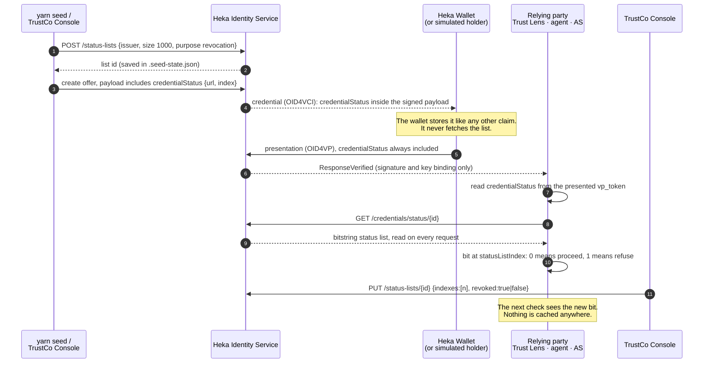

# `credentialStatus` — research and audit

Every credential in this demo carries a claim called `credentialStatus`. It is visible in Heka
Wallet as a block of JSON next to `role` and `org`, and it looks like plumbing that leaked into the
UI. This document explains why it is there, how it is used, what depends on it, and why the demo
cannot drop it. It is written for someone who has not worked on the demo.

For the chronological list of revocation findings and fixes, see
[REVOCATION-AUDIT.md](REVOCATION-AUDIT.md); this document refers to its finding numbers (G1–G17,
D1–D4) rather than repeating them.

## TL;DR

- `credentialStatus` is the credential's **revocation pointer**: the URL of the issuer's status
  list plus this credential's position (bit) in it.
- Heka Identity Service does not add a revocation pointer to SD-JWT credentials, and its verifier
  does not check revocation. The demo therefore writes the pointer into the credential payload
  itself at issuance, and every relying party reads the bit itself.
- Three parties read it: the Trust Lens verification engine (Resource Passports), the Acme Invoice
  Agent (A2A path) and the authorization server (MCP path) (both for the officer credential).
- It is the only thing that makes the TrustCo Console's **Revoke** buttons do anything. Without
  it, every presentation is refused (fail closed), or — if the check were weakened to tolerate its
  absence — revocation would stop working.
- It is deliberately **not** selectively disclosable: a holder must not be able to hide the
  pointer that would reveal their credential is revoked.
- We keep it as it is. The alternatives are worse or blocked upstream (see
  [Why we cannot drop it](#why-we-cannot-drop-it)).

## Background for a newcomer

Four concepts are enough to read the rest.

**SD-JWT VC.** The credential format used throughout. An SD-JWT VC is a JWT signed by the issuer
plus a list of _disclosures_. Each claim is either:

- **always disclosed** — written directly in the signed JWT payload; every presentation reveals
  it, and the holder cannot remove it without breaking the signature;
- **selectively disclosable** — replaced in the payload by a hash; the value travels in a separate
  disclosure that the holder may include or omit when presenting.

Which claims are which is decided by the issuer at issuance through a _disclosure frame_
(`disclosureFrame: { _sd: [...] }` in the Heka offer request).

**Status list.** A revocation registry in the form of a long bitstring. Each credential is assigned
one index; bit `0` means valid, bit `1` means revoked. The issuer publishes the list at a public
URL, and anyone holding the credential's pointer can check it. This demo uses the
[W3C Bitstring Status List](https://www.w3.org/TR/vc-bitstring-status-list/) format: a JSON
document whose `encodedList` is the bitstring, GZIP-compressed and multibase base64url-encoded.
One list serves many credentials, so a relying party fetching it does not reveal _which_
credential it is checking.

**Relying party.** Whoever receives a credential and decides whether to act on it. In this demo
there are three: the Trust Lens (deciding whether to engage a discovered resource), the agent
(deciding whether to run the payment export) and the authorization server (deciding whether to
mint an MCP token).

**Issuer, holder, verifier service.** TrustCo issues every credential through Heka Identity Service.
The operator's Heka Wallet holds the Finance Data Officer credential. Heka also runs the OID4VP
_verifier service_: the agent and the authorization server ask it to collect and cryptographically
verify a presentation, then make their own decision about it.

## Why the demo carries its own status pointer

The demo's story needs a kill switch: the issuer revokes a credential, and every party that relies
on it stops accepting it on the next use. Heka provides status lists, but not for the credential
format this demo uses, and not on the verifying side.

### Heka does not put a status pointer into SD-JWT credentials

When Heka creates an issuance offer, it assigns a status list index only to the W3C JWT and
Linked Data formats. The code says so directly
([`issuance-session.service.ts`](../../../heka-identity-service/src/openid4vc/issuance-sessions/issuance-session.service.ts:81)):

```ts
// sd+jwt and mso_mdoc do not support revocation
if (
  credential.format === OpenId4VciCredentialFormatProfile.JwtVcJson ||
  credential.format === OpenId4VciCredentialFormatProfile.JwtVcJsonLd ||
  credential.format === OpenId4VciCredentialFormatProfile.LdpVc
) {
  credentialIndexes.push(credentialIndex)
  credentialStatus = { location: this.statusListService.location(statusList.id), index: credentialIndex }
  ...
}
```

An SD-JWT credential issued by Heka therefore has no revocation pointer of any kind. Heka's own
revoke-by-issuance-session operation also refuses it, with `Credential does not support revocation`
([same file](../../../heka-identity-service/src/openid4vc/issuance-sessions/issuance-session.service.ts:213)).

The demo cannot switch formats to get around this: SD-JWT is what makes the officer presentation
disclose `role` and `org` and nothing else, which is the human-in-the-loop part of the argument.

### Heka's verifier does not check revocation

Heka's OID4VP verifier confirms that a presentation is cryptographically sound — issuer signature,
holder key binding, nonce. It does not consult any status list, and it does not restrict which
issuer a credential may come from (there is no trusted-issuer setting in
`heka-identity-service/src`). A credential revoked a minute ago still reaches `ResponseVerified`.

### The decision: an app-layer pointer, checked by each relying party

What Heka _does_ offer is enough to build the rest:

- **Status lists as a standalone resource.** `POST /status-lists` creates one,
  `PUT /status-lists/:id` sets or clears bits, and `GET /credentials/status/:id` serves it publicly,
  read from the database on every request.
- **Arbitrary issuance payloads.** The `payload` of an SD-JWT offer is copied into the credential
  as is, so the demo can put any claim into it.

So the demo writes the pointer into the payload itself and has every relying party check it. This
is design decision **D7**, recorded in
[ADR-001, decision 5](../spec/ADR-001-field-decisions.md), and proven end to end against a live
Heka by `yarn derisk` (issue → status-bound → revoke → observe) before any product code was built
on it.

The claim name and shape follow the W3C convention for `credentialStatus` because the list itself
is a W3C Bitstring Status List. It is a demo convention, not something SD-JWT VC specifies — see
[the IETF alternative](#4-move-the-pointer-into-the-standard-status-claim) for what the SD-JWT
world uses instead.

## Anatomy of the claim

As it appears in a credential (type: [`CredentialStatusClaim`](../src/core/types.ts:71)):

```json
"credentialStatus": {
  "statusListCredential": "http://localhost:3000/credentials/status/7b637fe2-5acd-4030-a1fa-bc1dc167832a",
  "statusListIndex": 3
}
```

| Field                  | Meaning                                                                                       |
| ---------------------- | --------------------------------------------------------------------------------------------- |
| `statusListCredential` | Public URL of TrustCo's status list on Heka (`GET /credentials/status/{id}`, unauthenticated) |
| `statusListIndex`      | This credential's bit in that list. `0` = live, `1` = revoked                                 |

What the URL returns (captured from the running stand, 2026-10-01):

```json
{
  "@context": ["https://www.w3.org/ns/credentials/v2"],
  "type": ["VerifiableCredential", "BitstringStatusListCredential"],
  "id": "7b637fe2-5acd-4030-a1fa-bc1dc167832a",
  "issuer": "did:hedera:testnet:3p7pfNArvXJmuPPN5aXEgvmQLnLtzS4zfK7tQTbcQBoE_0.0.10156402",
  "validFrom": "2026-10-01T11:52:32.163Z",
  "credentialSubject": {
    "id": "7b637fe2-5acd-4030-a1fa-bc1dc167832a",
    "type": "BitstringStatusList",
    "statusPurpose": "revocation",
    "encodedList": "uH4sIAAAAAAAAA2NgGEAAAKh0odt9AAAA"
  }
}
```

`encodedList` is `u` (multibase marker for base64url) + a GZIP stream of 1000 bits. The value above
is the all-clear list; the unit tests use it and a capture taken after revoking index 5
([`status-list.test.ts`](../src/core/__tests__/status-list.test.ts)). Bits are read
most-significant-first within each byte.

Note what the response is _not_: it is plain JSON, not a signed credential, and `validFrom` is
simply the time of the request.

### One list, four slots

`yarn seed` creates **one** status list for TrustCo (`size: 1000`, `purpose: revocation`) and hands
out fixed indexes ([`seed.ts:49`](../src/seed.ts:49)), stored in `.seed-state.json`:

| Index | Credential                                     | Held by               | Revoked from the console |
| ----- | ---------------------------------------------- | --------------------- | ------------------------ |
| 0     | Resource Passport — Acme Invoice Agent         | published by Acme     | yes                      |
| 1     | Resource Passport — Acme Invoice Data (MCP)    | published by Acme     | yes                      |
| 2     | Resource Passport issued for the lookalike Pro | published by Pro      | no                       |
| 3     | Finance Data Officer role credential           | the operator's wallet | yes                      |

The indexes are assigned by the demo, not by Heka — see
[Known limitations](#known-limitations) for what that implies.

### Why it is not selectively disclosable

The officer credential's disclosure frame is `{ _sd: ['role', 'org'] }`
([`officer-offer.ts`](../src/shared/officer-offer.ts:43)): only those two claims are selectively
disclosable, so `credentialStatus` sits in the signed payload and travels with **every**
presentation. Resource Passports disclose nothing selectively (`{ _sd: [] }`) because they are
public attestations.

This is deliberate. If the holder could omit the pointer, the person most interested in hiding a
revocation would be the one deciding whether the relying party learns where to look. With the
pointer in the signed payload, removing it breaks the issuer's signature.

## Lifecycle



### 1. Creation of the list

[`ensureIssuerAndStatusList`](../src/seed.ts:76) creates the list once, through
[`IdentityServiceClient.createStatusList`](../src/shared/identity-service.ts:137), and stores its id
and the four indexes in `.seed-state.json`. Re-running `yarn seed` keeps both; `yarn seed --reset`
creates a new list, which is why a reset invalidates the credential already in a wallet.

### 2. Issuance

The pointer is written into the payload at two places:

- **Resource Passports** — [`issueResourcePassport`](../src/seed.ts:135) in the seed. The seed claims
  the offer with a throwaway holder and publishes the SD-JWT as a static file on the publisher site
  (Heka has no "sign and return" endpoint; see [GOAL.md](GOAL.md#how-it-was-built)).
- **The Finance Data Officer credential** — [`createOfficerOffer`](../src/shared/officer-offer.ts:21),
  shared by the seed (prints a QR), the simulated holder and the TrustCo Console (**Send offer to
  wallet**). All three produce the same credential bound to index 3.

### 3. Holding

Heka Wallet stores the credential and treats `credentialStatus` as an ordinary attribute (see
[In the wallet](#in-the-wallet)). The wallet never reads the status list; only relying parties do.

### 4. Revocation and restore

The TrustCo Console's **Revoke** / **Restore** buttons call
[`POST /api/credentials/:key/status`](../src/console/server.ts:176), which looks up the index in
`.seed-state.json` and calls [`setRevoked`](../src/shared/identity-service.ts:142) →
`PUT /status-lists/{id}`. The console records each switch in its own Activity journal.

Because Heka's revoke-by-session operation does not work for SD-JWT (above), the console switches
the bit directly. That also means the console, not the presented credential, decides _which_ bit
it flips — it relies on the seed state matching what was issued.

## Who reads it and what they decide

There are three readers and two code paths. Both paths fetch the list on every check, never cache
it, and treat any failure to read it as a refusal.

### Trust Lens verification engine — Resource Passports

[`verifyEntry`](../src/core/verify.ts:200), step 6 of 6, after identity, attestation, issuer trust
and the binding checks. Status is checked last because it is the only input that can change between
two identical requests.

| Situation                                | Verdict     | Reason shown                                                |
| ---------------------------------------- | ----------- | ----------------------------------------------------------- |
| No `credentialStatus` in the passport    | `NO_STATUS` | passport carries no status pointer and can never be revoked |
| List unreachable, HTTP error, timeout    | `REVOKED`   | status list unavailable, refusing to assume valid: …        |
| Malformed pointer (not a URL, bad index) | `REVOKED`   | same, with the validation error                             |
| Bit set                                  | `REVOKED`   | credential is revoked by its issuer                         |
| Bit clear                                | `VERIFIED`  | —                                                           |

The evidence panel records `statusPointerPresent`, `statusListChecked` and `statusRevoked`.
The verdict gates **Engage**: `/api/engage` re-verifies on the server (G1), and every MCP call
re-verifies the entry first (G2), so revoking a passport stops that resource on its next use.

### Agent and authorization server — the officer credential

Both call the same two functions in
[`presented-credential.ts`](../src/shared/presented-credential.ts), once Heka reports
`ResponseVerified`:

1. [`readPresentedCredential`](../src/shared/presented-credential.ts:98) decodes the **presented
   `vp_token`** and takes `credentialStatus` from it. Not from Heka's `sharedAttributes` (which
   strips `iss` and `cnf`), and not from `.seed-state.json`.
2. [`assertPresentedCredentialValid`](../src/shared/presented-credential.ts:138) applies the policy
   in this order and stops at the first failure:

| #   | Check                                                         | Refusal reason        |
| --- | ------------------------------------------------------------- | --------------------- |
| 1   | `vct` is the role credential type                             | `wrong-type`          |
| 2   | `iss` is TrustCo (the trust anchor from the seed)             | `untrusted-issuer`    |
| 3   | disclosed `role` is `Finance Data Officer`                    | `wrong-role`          |
| 4   | `credentialStatus` is present                                 | `no-status`           |
| 5   | the list URL's origin is the Identity Service's own origin    | `foreign-status-list` |
| 6   | the list is readable within 10 s and the index is well-formed | `status-unavailable`  |
| 7   | the bit is clear                                              | `revoked`             |

Steps 4–7 are the status check. Step 5 exists because the pointer is the credential's own
assertion of where to look: a credential pointing at a list elsewhere is refused before anything
is fetched. The Trust Lens engine does not have this origin check; it relies on the issuer
signature and the trusted-issuer step.

What a refusal looks like:

- **A2A** — the task ends `failed`, with the reason in `authorizationResult`
  (`… the Finance Data Officer credential has been revoked by its issuer`). The agent's server view
  records the status check (index, list, `revoked`) in its journal.
- **MCP** — the authorization server's poll answers `denied` with the same `presentation` object,
  and no token is minted. A token minted _before_ the revocation stays valid for its remaining
  lifetime (≤ 300 s), as OAuth intends; **Drop token** in the Trust Lens discards it (G3).

On success the check travels to the Trust Lens as a `StatusCheck`
(`statusListCredential`, `statusListIndex`, `revoked: false`, `checkedAt`) inside the demo's
`authorizationResult` / `presentation` addition, built by
[`authorization-result.ts`](../src/shared/authorization-result.ts). The presentation card shows it
as **Status checked**, and the Trust Lens audit stores it with the decision.

`credentialStatus` is shown there as the relying party's own check, **not** as a claim the person
chose to share. The person chose `role` and `org`; the pointer came with the credential.

## What it affects

### The kill switches — the point of the demo

| Action in the console              | Index | Effect                                                                                                    |
| ---------------------------------- | ----- | --------------------------------------------------------------------------------------------------------- |
| Revoke Finance Data Officer        | 3     | The agent refuses the payment export **and** the AS refuses to mint — one revocation, both protocol paths |
| Revoke Acme Invoice Agent passport | 0     | That entry turns `REVOKED`, Engage is refused; the MCP entry stays `VERIFIED`                             |
| Revoke Acme Invoice Data passport  | 1     | The MCP entry turns `REVOKED` and its next tool call is refused; the agent stays `VERIFIED`               |
| Restore any of the above           | same  | The next check passes again                                                                               |

The second and third rows are the "per-resource granularity" claim in
[GOAL.md](GOAL.md#what-the-demo-argues). All four rows are only possible because the credential
carries its own pointer: nothing else in the system connects a presented credential to a bit.

### Invariants

`credentialStatus` is what two of the seven invariants in [CLAUDE.md](../CLAUDE.md) are made of:

- **4 — The relying party checks revocation itself, of the credential that was presented.** The
  presented credential's own pointer is the only way to know which bit belongs to it.
- **5 — Fail closed.** Missing pointer, foreign list, unreadable list and malformed index all
  refuse; none of them is read as "not revoked".

### Privacy

- The pointer is revealed to every verifier on every presentation. In general a per-credential
  index is a correlation handle: two verifiers comparing notes could tell they saw the same
  credential. Here every officer credential shares index 3 (G11), so it identifies the role slot
  rather than a person — a demo simplification, not a privacy design.
- Fetching the whole list does not tell the issuer which credential is being checked.
- The disclosure the person approves is still exactly `role` and `org` among the selectively
  disclosable claims. The always-disclosed claims (`credentialStatus`, `vct`, the issuer, the key
  binding) are part of any SD-JWT presentation.

### In the wallet

How Heka Wallet renders an SD-JWT credential
([`sd-jwt.ts`](../../../heka-wallet/app/src/credentials/mappers/sd-jwt.ts:27)):

```ts
const { _sd_alg, _sd_hash, iss, vct, cnf, iat, exp, nbf, status, ...visibleProperties } = sdJwtVcPayload
```

- Only that fixed list of envelope claims is hidden; everything else becomes an attribute. The
  wallet does not distinguish selectively disclosable claims from always-disclosed ones.
- Object values are rendered with `JSON.stringify`, hence the JSON string. Attribute names are
  the claim keys with `_` replaced by spaces, sorted alphabetically — no display metadata from the
  issuer is used.
- On the Credential Details screen every value is masked until **Show** is pressed; that applies
  to `credentialStatus`, `org` and `role` alike.
- **Proof Request (Share) screen — likely, not observed.** For a DIF Presentation Exchange request
  (which the agent and the AS send), Credo computes the disclosed payload as the signed payload
  plus the selected disclosures, and the wallet renders it with the same function
  ([`presentation.ts`](../../../heka-wallet/app/src/credentials/mappers/presentation.ts:179)). The
  Share screen should therefore list `credentialStatus`, `org` and `role` — three fields, not the
  "exactly two claims" the README describes. This is read from the code; confirm it on a device
  before relying on it.

## Why we cannot drop it

Every way of getting rid of the claim was considered. Each one breaks the demo's argument or is
blocked upstream.

### 1. Remove it from the credentials

- **Officer credential.** Step 4 of the policy refuses with `no-status`. Every presentation — real
  wallet, QR or simulated — is denied on both paths. The demo can no longer complete an A2A task
  or mint an MCP token.
- **Resource Passports.** Every entry becomes `NO_STATUS`, including the genuine ones. Nothing can
  be engaged.

Making the checks tolerate a missing pointer instead is the fail-open behaviour fixed as G8: a
credential that cannot be revoked would be accepted forever, and the console's Revoke buttons would
do nothing. That breaks invariants 4 and 5.

### 2. Check the seed state instead of the credential

Keep the claim out of the credential and have the agent and AS look up "the officer's index" in
`.seed-state.json`. This is exactly how the demo worked before task 1 (finding **G6**), and it is
wrong in a way the demo cannot afford: the relying party would be checking _what it believes was
issued_, not _what was presented_. Any other officer credential — a different issuer, a different
slot, a credential issued before a reset — would be judged on index 3's bit. The kill switch would
look like it works while checking the wrong credential. Invariant 4 exists to prevent this.

### 3. Make it selectively disclosable

The wallet would still show it (the wallet renders every claim it holds), so nothing is gained in
the UI. The holder could withhold it, the relying party would refuse with `no-status`, and the
demo would have handed the holder a way to fail instead of a way to hide. There is no upside.

### 4. Move the pointer into the standard `status` claim

SD-JWT VC's own mechanism is the `status` claim from the IETF Token Status List draft
(`"status": { "status_list": { "idx": 3, "uri": "…" } }`), and Heka Wallet already hides `status`
from its attribute list. Two problems:

- **The real form cannot work with Heka today.** `@sd-jwt/sd-jwt-vc`, used by Credo, sees
  `status.status_list` and fetches the `uri` expecting a signed JWT
  (`Accept: application/statuslist+jwt`), then verifies it. Heka serves a W3C Bitstring JSON
  document instead, so verification would fail — in the wallet when accepting the credential, and
  potentially in Heka's verifier.
- **A non-standard form only moves the problem.** Putting the W3C pointer under some other member
  of `status` (for example `status.bitstring_status_list`) is skipped by that library and would be
  hidden by the wallet. But it is an invented status mechanism under a registered claim name, it
  touches the seed, the offer, both readers, the types, the tests and the captured fixture, it
  needs a re-seed and a new offer to the wallet, and whether Heka's issuer and verifier accept it
  has not been tested. All of that buys a cleaner wallet screen, not a better trust model.

The proper fix is upstream: Heka issuing Token Status Lists for SD-JWT VCs and embedding `status`
itself. Then the demo's app-layer pointer (D7) could be retired altogether.

### 5. Hide it in the wallet

A one-line change in the wallet (add `credentialStatus` to the hidden envelope claims) would remove
it from both screens without touching the demo. It was not taken: it changes the product wallet to
accommodate a demo-specific claim, and on the Share screen it would hide something that is actually
sent to the verifier.

### Conclusion

`credentialStatus` stays, unchanged. It is the demo's revocation mechanism, not decoration. The
cost — a JSON attribute in the wallet — is cosmetic, and it is honest: the pointer really is part
of every presentation.

## Known limitations

| Limitation                                                                                                                                                                                                                                                                                                                                                                                                    | Reference                                     |
| ------------------------------------------------------------------------------------------------------------------------------------------------------------------------------------------------------------------------------------------------------------------------------------------------------------------------------------------------------------------------------------------------------------- | --------------------------------------------- |
| The status list is unsigned, and its `issuer` is never compared with the credential's `iss`. Whoever controls the response controls the verdict. The origin check (step 5) narrows this to Heka's own host on the authorization paths.                                                                                                                                                                        | G10, phase D3                                 |
| **Restore** clears a bit in a list declared `purpose: revocation`. In W3C terms that makes it suspension, not revocation. Kept so the stand can be re-run without re-seeding.                                                                                                                                                                                                                                 | G11, [§ Restore](REVOCATION-AUDIT.md#restore) |
| All officer credentials share index 3. Revoking one revokes every officer credential ever issued by this seed; per-holder revocation is not possible.                                                                                                                                                                                                                                                         | G11                                           |
| Heka's index allocator does not know about the demo's indexes. SD-JWT offers never reserve an index, so Heka's bookkeeping says the list is empty, and Heka's `getOrCreate` picks _any_ list of the account with free capacity. A JWT-VC credential issued through the same account could be handed index 0 of this list — Acme's agent passport. The demo issues only SD-JWT, so this does not happen today. | `status-list.service.ts:85` in Heka           |
| Check-then-use: the officer credential is checked when the sensitive step starts, and the passport when Engage runs; neither is re-checked while the task runs.                                                                                                                                                                                                                                               | G16                                           |
| A token minted before a revocation lives out its ≤ 300 s; an issued authorization code never expires, and `/token` does not re-check status.                                                                                                                                                                                                                                                                  | G3 (Drop token), G4 / D1                      |
| The URL says `localhost:3000`. That is correct: the relying parties run on the host and fetch it there. The wallet never fetches it, so it does not need to be reachable from the device.                                                                                                                                                                                                                     | —                                             |

## Where to look in the code

| What                                                        | Where                                                                                                                                                                                                                |
| ----------------------------------------------------------- | -------------------------------------------------------------------------------------------------------------------------------------------------------------------------------------------------------------------- |
| Claim type                                                  | [`src/core/types.ts`](../src/core/types.ts:71)                                                                                                                                                                       |
| Decode the list, read a bit, fetch with timeout, validation | [`src/core/status-list.ts`](../src/core/status-list.ts)                                                                                                                                                              |
| Passport verification, step 6                               | [`src/core/verify.ts`](../src/core/verify.ts:200)                                                                                                                                                                    |
| Officer presentation policy (both relying parties)          | [`src/shared/presented-credential.ts`](../src/shared/presented-credential.ts)                                                                                                                                        |
| Agent's use                                                 | [`src/agent/index.ts`](../src/agent/index.ts:396)                                                                                                                                                                    |
| Authorization server's use                                  | [`src/mcp/auth-server.ts`](../src/mcp/auth-server.ts:197)                                                                                                                                                            |
| What the client is told                                     | [`src/shared/authorization-result.ts`](../src/shared/authorization-result.ts)                                                                                                                                        |
| Status list API client                                      | [`src/shared/identity-service.ts`](../src/shared/identity-service.ts:135)                                                                                                                                            |
| Writing the pointer: passports / officer                    | [`src/seed.ts`](../src/seed.ts:105) · [`src/shared/officer-offer.ts`](../src/shared/officer-offer.ts)                                                                                                                |
| Revoke / Restore                                            | [`src/console/server.ts`](../src/console/server.ts:176)                                                                                                                                                              |
| Tests                                                       | [`status-list.test.ts`](../src/core/__tests__/status-list.test.ts), [`verify.test.ts`](../src/core/__tests__/verify.test.ts), [`presented-credential.test.ts`](../src/shared/__tests__/presented-credential.test.ts) |
| End-to-end proof against live Heka                          | `yarn derisk` ([`derisk-revocation.ts`](../src/scripts/derisk-revocation.ts))                                                                                                                                        |
| Heka: why SD-JWT gets no status                             | [`issuance-session.service.ts`](../../../heka-identity-service/src/openid4vc/issuance-sessions/issuance-session.service.ts:81)                                                                                       |
| Heka: the public list endpoint                              | [`status-list.public.controller.ts`](../../../heka-identity-service/src/revocation/status-list/status-list.public.controller.ts)                                                                                     |
| Wallet: how claims are rendered                             | [`sd-jwt.ts`](../../../heka-wallet/app/src/credentials/mappers/sd-jwt.ts:27)                                                                                                                                         |
